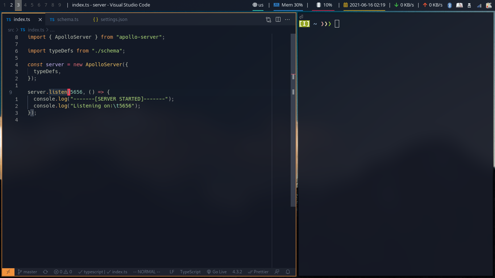

# My Current Config files
## installation
1- copy each config file to its respective place
2- download the packges in packages.pacman.txt
3- install yay
4- download the packages in packages.yay.txt
## screenshot

